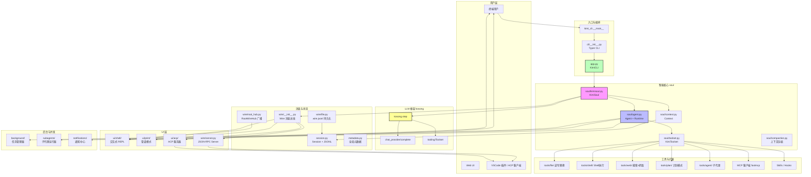
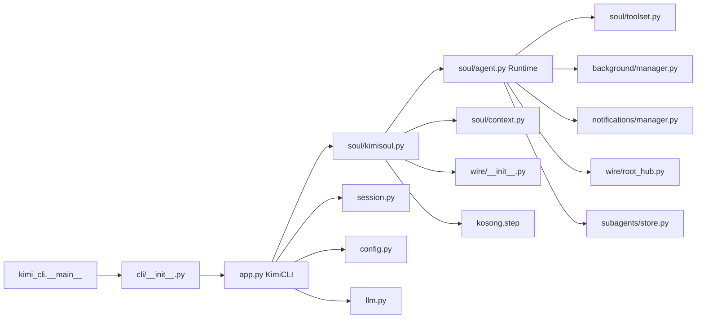
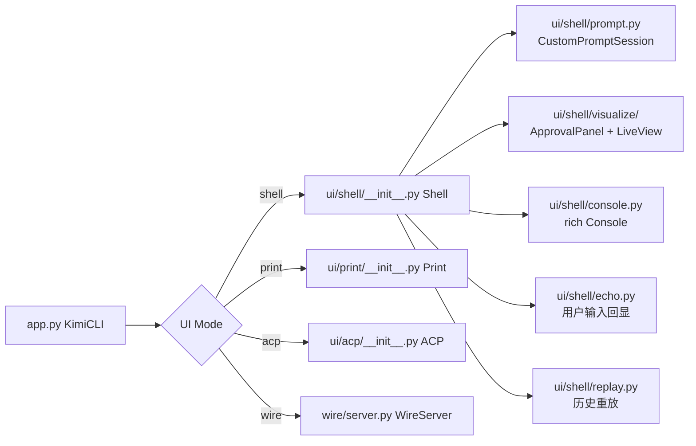
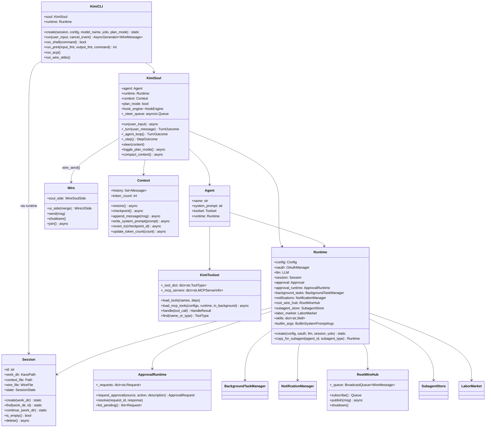
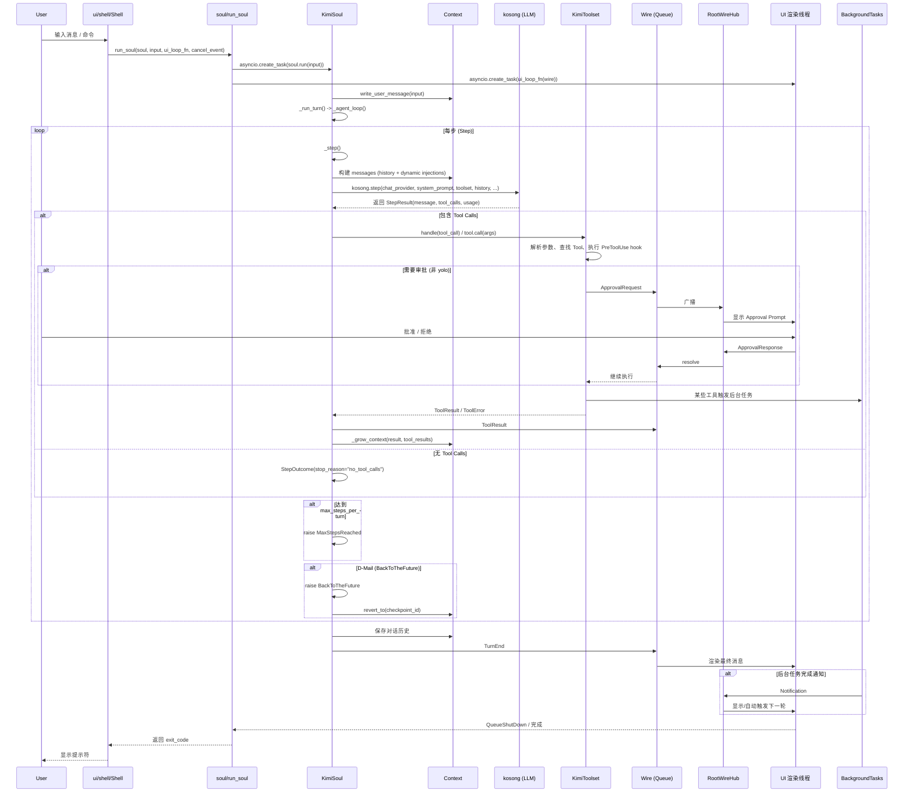
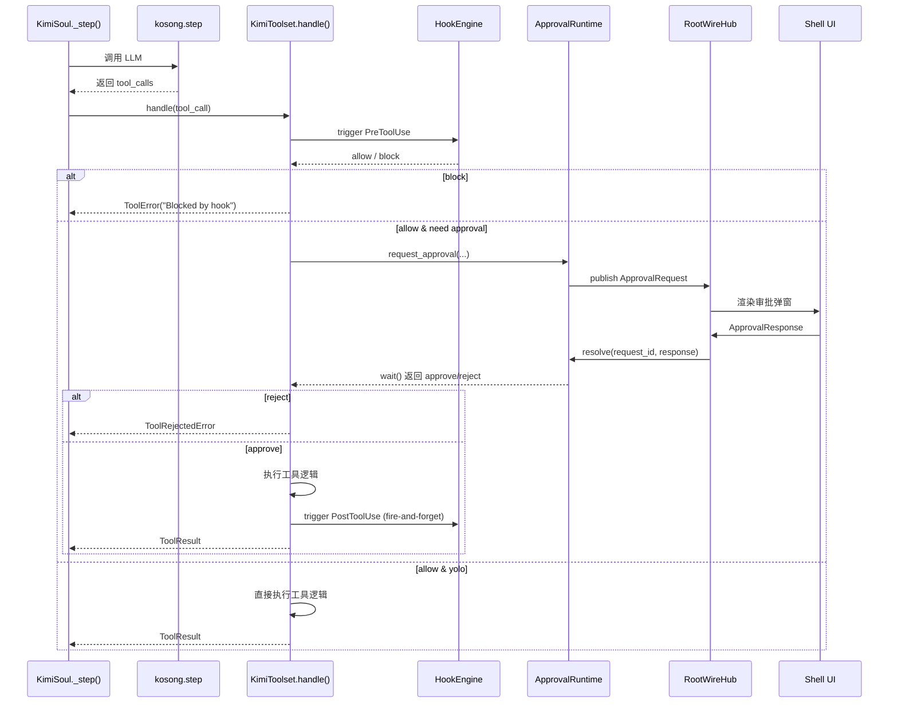
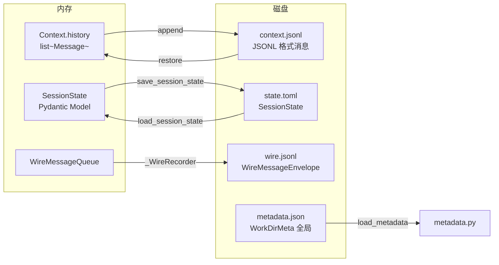

# kimi-cli 源码深度架构分析与 Rust 逐行翻译计划

> 基于 `src/kimi_cli` 及 `packages/kosong` 的深入分析  
> 规模：约 **210 个 Python 文件**，**46,500+ 行代码**

---

## 目录

1. [项目概览与技术栈](#一项目概览与技术栈)
2. [分层架构图](#二分层架构图)
3. [模块依赖图（文件级）](#三模块依赖图文件级)
4. [核心对象关系图](#四核心对象关系图)
5. [命令执行流程图](#五命令执行流程图)
6. [数据流转图](#六数据流转图)
7. [关键子系统详解](#七关键子系统详解)
8. [Rust 逐行翻译计划](#八rust-逐行翻译计划)
9. [风险与注意事项](#九风险与注意事项)

---

## 一、项目概览与技术栈

| 维度 | 说明 |
|------|------|
| **入口** | `kimi_cli.__main__:main` → `kimi_cli.cli:cli`（Typer） |
| **核心框架** | `asyncio` + `Typer` + `Pydantic` + `kosong`（自研 LLM/Tool 框架） |
| **交互 UI** | `prompt-toolkit`（REPL 输入）+ `rich`（渲染） |
| **通信协议** | 自研 `Wire`（基于 `asyncio.Queue` 的消息总线）+ JSON-RPC（Wire Server）+ ACP |
| **持久化** | `JSONL`（`context.jsonl` 存对话历史，`wire.jsonl` 存交互事件）+ `TOML`（配置） |
| **扩展机制** | MCP（外部工具服务器）、Skills（Markdown 技能定义）、Hooks、Subagents |

### 1.1 目录结构

```
src/kimi_cli/
├── __main__.py              # CLI 入口
├── app.py                   # KimiCLI 应用 orchestration
├── cli/                     # Typer CLI 定义 + 子命令
├── soul/                    # 智能核心（Agent、Runtime、KimiSoul、Context）
├── tools/                   # 内置工具 + MCP 集成
├── wire/                    # 消息总线 + 序列化 + Wire Server
├── ui/                      # UI 层（shell / print / acp）
├── background/              # 后台任务管理
├── subagents/               # 子代理注册表与运行器
├── notifications/           # 通知中心
├── hooks/                   # 事件钩子系统
├── session.py               # Session 生命周期
├── config.py                # 配置模型与加载
├── llm.py                   # LLM 工厂
├── auth/                    # OAuth
├── utils/                   # 通用工具
└── web/, vis/               # Web/Vis 服务器（独立进程）

packages/kosong/src/kosong/  # 核心依赖（LLM/Tool 框架）
├── chat_provider/           # 各厂商 ChatProvider 实现
├── tooling/                 # Tool、Toolset、错误类型
├── message.py               # Message、ContentPart
└── __init__.py              # step() 核心循环
```

---

## 二、分层架构图



---

## 三、模块依赖图（文件级）

### 3.1 核心启动链



### 3.2 UI 模式分支



---

## 四、核心对象关系图



---

## 五、命令执行流程图

### 5.1 顶层启动流程

```mermaid
flowchart TD
    Start([用户执行 kimi]) --> Main[kimi_cli.__main__:main]
    Main --> Normalize[kimi_cli.utils.proxy:normalize_proxy_env]
    Main --> Typer[cli(args, prog_name)]

    Typer --> Parse{解析参数}
    Parse -->|子命令| Sub[login / logout / acp / term / export ...]
    Parse -->|无子命令| MainCmd[kimi callback<br/>cli/__init__.py:353]

    MainCmd --> Validate{参数校验}
    Validate -->|冲突| Error[抛出 typer.BadParameter]
    Validate --> Pass --> ConfigLoad[加载 Config<br/>load_config / load_config_from_string]
    ConfigLoad --> _run[_run(session_id, prefill)]

    _run --> SessionMgr{Session 来源}
    SessionMgr -->|--session ID| Find[Session.find]
    SessionMgr -->|--continue| Continue[Session.continue_]
    SessionMgr -->|新建| Create[Session.create]
    SessionMgr -->|--session ""| Picker[交互式选择 Session]

    Find --> KimiCreate[KimiCLI.create(session, config, ...)]
    Continue --> KimiCreate
    Create --> KimiCreate
    Picker --> KimiCreate

    KimiCreate --> Step1["1. 加载/合并 Config<br/>覆盖模型、思考模式、YOLO"]
    Step1 --> Step2["2. 创建 OAuthManager + LLM<br/>create_llm(provider, model)"]
    Step2 --> Step3["3. Runtime.create()<br/>扫描工作区、加载 AGENTS.md<br/>发现 Skills、构建 Approval/Notification/BgTasks"]
    Step3 --> Step4["4. load_agent()<br/>加载 system prompt (Jinja2)<br/>注册 tools / MCP / plugins / subagent types"]
    Step4 --> Step5["5. 恢复 Context<br/>context.restore()"]
    Step5 --> Step6["6. 实例化 KimiSoul<br/>注入 HookEngine、绑定 plan mode"]
    Step6 --> Step7["7. 返回 KimiCLI 实例"]

    Step7 --> UIMatch{匹配 UI 模式}
    UIMatch -->|shell| Shell[instance.run_shell(prompt)]
    UIMatch -->|print| Print[instance.run_print(...)]
    UIMatch -->|acp| ACP[instance.run_acp()]
    UIMatch -->|wire| WireSrv[instance.run_wire_stdio()]

    Shell --> REPL[ui.shell.Shell.run()]
    Print --> Pipe[ui.print.Print.run()]
    ACP --> ACPSrv[ui.acp.ACP.run()]
    WireSrv --> JSONRPC[wire.server.WireServer.serve()]

    REPL --> End1[_reload_loop 处理 Reload/<br/>SwitchToWeb/SwitchToVis]
    Pipe --> End2[_post_run 清理空 Session]
```

### 5.2 _reload_loop 异常驱动控制流

```mermaid
flowchart TD
    A[_reload_loop 开始] --> B{while True}
    B --> C[_run(session_id, prefill)]
    C --> D{异常类型}
    D -->|正常结束| E[break 循环]
    D -->|Reload| F[清理旧空 Session<br/>更新 session_id/prefill<br/>continue]
    D -->|SwitchToWeb| G[_post_run 当前 Session<br/>return "web"]
    D -->|SwitchToVis| H[_post_run 当前 Session<br/>return "vis"]
    D -->|其他异常| I[清理 _latest_created_session<br/>raise]
    F --> B
    E --> J[_post_run(last_session, exit_code)]
    J --> K[return None, exit_code]
```

---

## 六、数据流转图

### 6.1 单轮对话完整数据流（Soul 核心循环）



### 6.2 Wire 消息总线内部流转

```mermaid
flowchart LR
    Soul[WireSoulSide] -->|send(msg)| Raw[Raw BroadcastQueue]
    Soul -->|merge_in_place| Merge[Merge Buffer]
    Merge -->|flush| Merged[Merged BroadcastQueue]
    Raw -->|订阅| UI1[WireUISide<br/>raw]
    Merged -->|订阅| UI2[WireUISide<br/>merged]
    Merged -->|订阅| Rec[_WireRecorder]
    Rec -->|append_message| File[WireFile<br/>wire.jsonl]
```

### 6.3 上下文压缩（Compaction）流程

```mermaid
flowchart TD
    A[_agent_loop 开始新 step] --> B{should_auto_compact?}
    B -->|是| C[wire_send CompactionBegin]
    C --> D[_compact_with_retry]
    D --> E[SimpleCompaction.compact(history, llm)]
    E --> F[调用 LLM 生成摘要]
    F --> G[返回 CompactionResult]
    G --> H[context.clear()]
    H --> I[重写 system_prompt]
    I --> J[append_message(compaction_result.messages)]
    J --> K[追加 background_tasks snapshot]
    K --> L[context.update_token_count]
    L --> M[wire_send CompactionEnd]
    M --> N[触发 PostCompact hook]
    B -->|否| O[正常执行 step]
```

### 6.4 工具调用与审批数据流



### 6.5 Session 持久化数据流



---

## 七、关键子系统详解

### 7.1 Wire 消息总线 (`wire/`)

- **职责**：连接 Soul（智能核心）与各 UI 模式的异步消息管道。
- **核心实现**：`wire/__init__.py` 中基于 `asyncio.Queue` 的 `Wire` 类，分为 `soul_side` 和 `ui_side`。
  - `WireSoulSide.send(msg)`：同时写入 raw queue 和 merge buffer；merge buffer 会将连续的 `MergeableMixin`（如 `TextPart`）合并，减少 UI 渲染次数。
  - `WireUISide.receive()`：从 subscribed queue 中异步读取消息。
- **持久化**：`wire/file.py` 中的 `WireFile` 将消息以 JSONL 格式追加到 `wire.jsonl`。
- **广播中心**：`wire/root_hub.py` 中的 `RootWireHub` 通过 `BroadcastQueue` 实现多订阅者广播，用于 approval 请求、后台任务通知等 out-of-turn 消息。
- **服务器**：`wire/server.py` 中的 `WireServer` 通过 JSON-RPC over stdio 对外暴露服务。

### 7.2 Soul 状态机 (`soul/kimisoul.py`)

- **核心方法**：`run(user_input)` 驱动整个对话轮次。
- **子方法**：
  - `_turn(user_message)`：写入用户消息，调用 `_agent_loop()`。
  - `_agent_loop()`：处理一轮完整对话（可包含多步）。循环调用 `_step()`，处理 `BackToTheFuture`、`MaxStepsReached`。
  - `_step()`：调用 LLM（`kosong.step()`）、执行工具、处理 `StatusUpdate`、调用 `_grow_context()`。
  - `_call_llm_with_retry()`：基于 `tenacity` 实现指数退避重试（429/500/502/503/504、连接超时、空响应）。
  - `_run_with_connection_recovery()`：处理 401 后 OAuth token refresh，以及 `RetryableChatProvider` 的恢复机制。
- **计划模式**：`plan_mode` 通过动态注入系统（`dynamic_injection/`）控制工具可用性。
- **FlowRunner**：支持 Ralph 自动化循环（`/ralph`），通过状态机节点驱动重复执行。

### 7.3 运行时容器 (`soul/agent.py:Runtime`)

- **性质**：一个巨型 dataclass，聚合了 agent 所需的全部外部依赖。
- **关键字段**：
  - `llm`: 大模型接口（`kosong` 封装）。
  - `approval` / `approval_runtime`: 人机审批状态与请求队列。
  - `background_tasks`: 后台任务生命周期管理（通过子进程 worker 实现）。
  - `notifications`: 通知中心，支持 LLM 消费未读通知。
  - `root_wire_hub`: 全局 Wire 消息广播中心，用于多 agent 间通信。
  - `subagent_store`: 子代理实例持久化存储。
  - `labor_market`: 子代理类型注册表。
  - `skills`: 已发现的技能映射。
  - `builtin_args`: Jinja2 system prompt 参数（工作区目录、AGENTS.md、Skills 等）。

### 7.4 工具系统 (`tools/` + `soul/toolset.py`)

- **KimiToolset**：继承自 `kosong.tooling.Toolset`，负责加载、注册、调度所有工具。
- **内置工具**：
  - `file/`: `ReadFile`, `WriteFile`, `StrReplaceFile`, `Glob`, `GrepLocal`, `ReadMedia`
  - `shell/`: `Shell`（执行 shell 命令）
  - `web/`: `WebSearch`, `WebFetch`
  - `plan/`: `EnterPlanMode`, `ExitPlanMode`
  - `ask_user/`: `AskUserQuestion`
  - `agent/`: `Agent`（子代理调用）
  - `todo/`: `Todo`
  - `think/`: `Think`
  - `background/`: `TaskList`, `TaskOutput`
  - `dmail/`: `SendDMail`
- **MCP 集成**：通过 `fastmcp` 读取 MCP 配置，启动外部 MCP 服务器（stdio/SSE），将其工具动态注册到 `KimiToolset`。
- **依赖注入**：`KimiToolset._load_tool()` 通过 `inspect.signature()` 将 `Runtime`、`Config`、`Session` 等注入工具构造函数。

### 7.5 UI 层 (`ui/`)

| 模式 | 文件 | 用途 | 关键依赖 |
|------|------|------|----------|
| Shell | `ui/shell/__init__.py` | 交互式 REPL，最复杂 | `prompt-toolkit` + `rich` |
| Print | `ui/print/__init__.py` | 非交互式（管道/脚本） | `rich`（无输入） |
| ACP | `ui/acp/__init__.py` | ACP 协议服务器 | `acp` |
| Wire | `wire/server.py` | JSON-RPC over stdio | `acp.stdio_streams` |

**Shell UI 关键组件**：
- `CustomPromptSession`：`prompt_toolkit` 的自定义会话，支持 agent/running/shell 三种模式。
- `visualize/`：Approval Prompt、Live View、Question Panel、BTW Panel 的渲染逻辑。
- `_BackgroundCompletionWatcher`：监听后台任务完成事件，自动触发下一轮对话。
- `replay_recent_history()`：从 `wire.jsonl` 恢复最近一次对话的 UI 状态。

### 7.6 后台任务与子代理 (`background/` + `subagents/`)

- **BackgroundTaskManager**：
  - 通过子进程启动 `kimi __background-task-worker` 执行长时间任务。
  - 维护 `tasks/` 目录下的任务状态文件。
  - 提供 `completion_event`（`asyncio.Event`），任务完成后通知 Shell 自动触发。
- **SubagentStore**：
  - 在 `session.dir / "subagents"` 下持久化子代理实例状态。
  - 子代理通过 `tools/agent/` 调用，拥有独立的 `KimiSoul` 和 `Runtime`（`copy_for_subagent`）。
- **LaborMarket**：
  - 注册内置子代理类型（如 `code-reviewer`）。
  - 子代理类型定义包含 `agent_file`、`tool_policy`、`when_to_use`。

---

## 八、Rust 逐行翻译计划

### 8.1 总体策略

- **非重构式翻译**：第一阶段保持逻辑与 Python 一一对应，每行 Python 都有对应的 Rust 实现，先保证行为一致，再优化内存和并发模型。
- **Workspace 拆分**：将单体 Python 包拆分为多个 Rust crate，降低编译耦合。
- **`kosong` 重写**：核心依赖 `kosong`（Python LLM/Tool 框架）无法复用，必须在内核层重写。
- **UI 技术栈迁移**：
  - `Typer` → `clap`（含 derive macro）
  - `prompt-toolkit` + `rich` → `tokio` + `crossterm` + `ratatui`
  - `Pydantic` → `serde` + `validator` / `schemars`
  - `Jinja2` → `minijinja`

### 8.2 建议的 Crate 结构

```text
kimi-cli-rust/                 # Workspace root
├── crates/
│   ├── kimi-core/             # 配置、会话、Wire、状态、通用类型
│   ├── kimi-llm/              # ChatProvider、Message、Token 计数、流式响应
│   ├── kimi-tools/            # Tool trait、内置工具、MCP 客户端
│   ├── kimi-soul/             # Agent、Runtime、KimiSoul、Context、Compaction
│   ├── kimi-ui/               # Shell/Print/ACP/Wire UI 渲染
│   ├── kimi-cli/              # clap CLI、main.rs、子命令
│   └── kimi-utils/            # 路径、日志、信号、时间、子进程
└── Cargo.toml
```

### 8.3 Python → Rust 核心映射表

| Python 概念 | 文件示例 | Rust 对应方案 |
|-------------|----------|---------------|
| `typer.Typer` + callback | `cli/__init__.py` | `clap::Parser` + 子命令 enum + `flatten` |
| `pydantic.BaseModel` | `config.py`, `wire/types.py` | `serde::Deserialize/Serialize` struct + `validator` |
| `dataclass` | `soul/agent.py` | `#[derive(Debug, Clone)] struct` |
| `Protocol` | `soul/__init__.py: Soul` | `trait Soul { async fn run(...) }` |
| `asyncio.Queue` | `wire/__init__.py` | `tokio::sync::mpsc` 或 `tokio::sync::broadcast` |
| `asyncio.Event` | 多处 | `tokio::sync::Notify` 或 `tokio::sync::watch` |
| `ContextVar[Wire]` | `soul/__init__.py` | `tokio::task_local!` 或显式 `Arc<Wire>` 传递 |
| `rich.Console` / `rich.Live` | `ui/shell/` | `ratatui::Terminal` + `crossterm` |
| `prompt_toolkit` | `ui/shell/prompt.py` | 自定义 `tokio::io::stdin` 事件循环 |
| `aiofiles` | 多处 | `tokio::fs` |
| `Jinja2` | `soul/agent.py` | `minijinja::Environment` |
| `json.loads` / `json.dumps` | 多处 | `serde_json` |
| `loguru` | `utils/logging.py` | `tracing` + `tracing-subscriber` |
| `tenacity` | `soul/kimisoul.py` | `tokio::time::sleep` + 手动重试循环或 `backoff` crate |
| `shutil.rmtree` | `session.py` | `tokio::task::spawn_blocking` + `std::fs::remove_dir_all` |
| `importlib.import_module` | `soul/toolset.py` | 无需动态导入；Rust 中直接静态注册 |
| `inspect.signature` | `soul/toolset.py` | 构造函数显式传参；无运行时反射 |

### 8.4 分阶段逐行翻译路线图

由于代码量巨大（46k+ 行），建议按以下 **8 个阶段** 进行，**每个阶段内部要求逐文件、逐行翻译**：

#### 阶段 1：基础类型与配置（第 1-3 周）
**目标**：把所有“无业务逻辑的纯数据结构”先固化在 Rust 中。
- **文件映射**：
  - `src/kimi_cli/config.py` → `crates/kimi-core/src/config.rs`
  - `src/kimi_cli/wire/types.py` → `crates/kimi-core/src/wire_types.rs`
  - `src/kimi_cli/session_state.py` → `crates/kimi-core/src/session_state.rs`
  - `src/kimi_cli/metadata.py` → `crates/kimi-core/src/metadata.rs`
  - `src/kimi_cli/share.py` → `crates/kimi-core/src/paths.rs`
- **关键工作**：
  - 将所有 Pydantic model 转为 `serde` struct。
  - `SecretStr` 映射为 `secrecy::SecretString`。
  - `tomlkit` 读写映射为 `toml` crate。
  - `KaosPath` 若包含特殊逻辑，需重新实现为 `struct KaosPath(PathBuf)`。

#### 阶段 2：会话与持久化层（第 4-5 周）
**目标**：翻译 `Session` 和 `WireFile`，确保会话生命周期可用。
- **文件映射**：
  - `src/kimi_cli/session.py` → `crates/kimi-core/src/session.rs`
  - `src/kimi_cli/wire/file.py` → `crates/kimi-core/src/wire_file.rs`
  - `src/kimi_cli/wire/__init__.py` → `crates/kimi-core/src/wire.rs`
  - `src/kimi_cli/wire/root_hub.py` → `crates/kimi-core/src/root_hub.rs`
- **关键工作**：
  - `Session.create/find/list/continue_` 逐个函数翻译。
  - `WireFile` 的 JSONL append/read 使用 `tokio::fs::File` + `tokio::io::AsyncBufRead` 实现。
  - `Wire` 的消息总线用 `tokio::sync::broadcast` 实现 raw/merged 双通道。
  - `RootWireHub` 用 `tokio::sync::broadcast` 替换 `BroadcastQueue`。

#### 阶段 3：LLM 抽象层（kosong 重写）（第 6-10 周）
**目标**：重写 `kosong` 的核心接口，因为无法从 Python 复用。
- **文件映射**：
  - `src/kimi_cli/llm.py` → `crates/kimi-llm/src/lib.rs`
  - `src/kimi_cli/soul/message.py` → `crates/kimi-llm/src/message.rs`
  - `src/kimi_cli/soul/compaction.py` → `crates/kimi-soul/src/compaction.rs`
  - `packages/kosong/src/kosong/message.py` → `crates/kimi-llm/src/message.rs`
  - `packages/kosong/src/kosong/tooling/` → `crates/kimi-llm/src/tooling/`
  - `packages/kosong/src/kosong/chat_provider/` → `crates/kimi-llm/src/providers/`
- **关键工作**：
  - 定义 `trait ChatProvider { async fn complete(...) -> Result<AssistantMessage, ...>; }`
  - 定义 `struct Message { role, content }` 和 `enum ContentPart { Text(...), Image {...}, ... }`
  - 实现 Kimi API 的 HTTP 客户端（基于 `reqwest` + `reqwest-eventsource` 或自研 SSE 解析）。
  - 翻译 `kosong.step()`：将 Python 中的流式 tool call 解析逻辑完整迁移到 Rust。
  - 翻译 token 估算、上下文压缩逻辑。

#### 阶段 4：工具系统（第 11-14 周）
**目标**：翻译 `KimiToolset` 和所有内置工具。
- **文件映射**：
  - `src/kimi_cli/soul/toolset.py` → `crates/kimi-tools/src/toolset.rs`
  - `src/kimi_cli/tools/**/*.py` → `crates/kimi-tools/src/tools/{file, shell, web, ask_user, plan, todo, agent, ...}.rs`
  - `src/kimi_cli/tools/utils.py` → `crates/kimi-tools/src/utils.rs`
- **关键工作**：
  - 定义 `trait Tool: Send + Sync { fn name(&self) -> &str; fn schema(&self) -> Value; async fn call(&self, args: Value) -> Result<Value, ToolError>; }`
  - 依赖注入（Python 中通过 `tool_deps` dict + `inspect.signature`）在 Rust 中改为构造函数注入 `Arc<Runtime>`。
  - 每个内置工具逐文件翻译：`Shell` 用 `tokio::process::Command`；文件操作用 `tokio::fs`；Web 搜索用 `reqwest`。
  - MCP 客户端：评估 `rmcp` (Rust MCP SDK) 或自研 JSON-RPC client over stdio。

#### 阶段 5：Soul 与 Agent 核心（第 15-19 周）
**目标**：翻译最核心的智能循环。
- **文件映射**：
  - `src/kimi_cli/soul/agent.py` → `crates/kimi-soul/src/agent.rs` + `runtime.rs`
  - `src/kimi_cli/soul/kimisoul.py` → `crates/kimi-soul/src/kimisoul.rs`
  - `src/kimi_cli/soul/context.py` → `crates/kimi-soul/src/context.rs`
  - `src/kimi_cli/soul/approval.py` → `crates/kimi-soul/src/approval.rs`
  - `src/kimi_cli/soul/slash.py` → `crates/kimi-soul/src/slash.rs`
  - `src/kimi_cli/soul/__init__.py`（`run_soul`） → `crates/kimi-soul/src/runner.rs`
  - `src/kimi_cli/soul/dynamic_injection*.py` → `crates/kimi-soul/src/dynamic_injection/`
  - `src/kimi_cli/soul/denwarenji.py` → `crates/kimi-soul/src/denwarenji.rs`
- **关键工作**：
  - `Runtime`（超大 dataclass）→ 一个 `pub struct Runtime { ... }`，字段一一对应，用 `Arc<...>` 共享引用。
  - `KimiSoul.run()` 是约 1500 行的状态机，需拆分为多个 `async fn`（`run_turn`, `agent_loop`, `step`, `grow_context`, `compact_context`）。
  - `wire_send()` 中的 `ContextVar` 替换为函数参数传递 `Arc<Wire>`，避免全局隐式状态。
  - `DynamicInjection` 系统翻译为 trait object `Box<dyn InjectionProvider>`。
  - `BackToTheFuture` 异常 → Rust 中自定义错误类型或控制流枚举。

#### 阶段 6：后台任务、子代理与 Hooks（第 20-22 周）
**目标**：翻译并发辅助子系统。
- **文件映射**：
  - `src/kimi_cli/background/*.py` → `crates/kimi-soul/src/background/`
  - `src/kimi_cli/subagents/*.py` → `crates/kimi-soul/src/subagents/`
  - `src/kimi_cli/hooks/*.py` → `crates/kimi-soul/src/hooks/`
  - `src/kimi_cli/notifications/*.py` → `crates/kimi-soul/src/notifications/`
  - `src/kimi_cli/approval_runtime/` → `crates/kimi-soul/src/approval_runtime/`
- **关键工作**：
  - `BackgroundTaskManager` 用 `tokio::process::Command` + `tokio::task` 管理子进程。
  - `SubagentStore` 用文件系统状态机 + `tokio::sync::Mutex` 保护。
  - `HookEngine` 的事件触发改为 `tokio::sync::mpsc` 异步回调或 `tokio::task::spawn`。
  - `ApprovalRuntime` 中的 `asyncio.Future` 替换为 `tokio::sync::oneshot`。

#### 阶段 7：UI 层（第 23-27 周）
**目标**：将所有 UI 模式翻译为 Rust 终端/服务器框架。
- **文件映射**：
  - `src/kimi_cli/ui/shell/__init__.py` → `crates/kimi-ui/src/shell/mod.rs`
  - `src/kimi_cli/ui/shell/prompt.py` → `crates/kimi-ui/src/shell/prompt.rs`（crossterm 输入处理）
  - `src/kimi_cli/ui/shell/visualize.rs` → `crates/kimi-ui/src/shell/render.rs`（ratatui widget）
  - `src/kimi_cli/ui/print/__init__.py` → `crates/kimi-ui/src/print.rs`
  - `src/kimi_cli/ui/acp/__init__.py` → `crates/kimi-ui/src/acp.rs`
  - `src/kimi_cli/wire/server.py` → `crates/kimi-ui/src/wire_server.rs`
- **关键工作**：
  - `Shell` 的 REPL 主循环用 `tokio::select!` 监听：用户输入事件、Wire 消息、后台任务完成信号、Ctrl-C 信号。
  - `ratatui` 实现 `rich.Panel` 的等价物（`Block` + `Borders`）。
  - `WireServer` 的 JSON-RPC 使用 `tokio::io::AsyncBufReadExt::lines()` + `serde_json`。
  - 颜色主题系统映射到 `ratatui::style::Color` 和自定义 palette。

#### 阶段 8：CLI 入口与集成（第 28-32 周）
**目标**：组装所有 crate，实现主入口和子命令。
- **文件映射**：
  - `src/kimi_cli/__main__.py` → `crates/kimi-cli/src/main.rs`
  - `src/kimi_cli/cli/__init__.py` → `crates/kimi-cli/src/cli.rs`（`clap` Parser）
  - `src/kimi_cli/cli/mcp.py`, `export.py`, `info.py` 等 → `crates/kimi-cli/src/commands/`
  - `src/kimi_cli/app.py` → `crates/kimi-cli/src/app.rs`（`App` struct 等价 `KimiCLI`）
- **关键工作**：
  - `clap` 构建与 Typer 完全一致的命令行参数树（包括 `--yolo`, `--plan`, `--model`, `--session`, `--print`, `--wire` 等）。
  - `_reload_loop` 的异常驱动控制流在 Rust 中用 `loop { match run(...).await { ... } }` 实现。
  - E2E 测试：用 `assert_cmd` + `tempfile` 复刻 Python 的 `tests_e2e/`。

### 8.5 逐行翻译示例

**示例 1：Pydantic Model → serde struct**

Python (`config.py` 节选)：
```python
class LLMProvider(BaseModel):
    type: ProviderType
    base_url: str
    api_key: SecretStr
    env: dict[str, str] | None = None
    custom_headers: dict[str, str] | None = None
    oauth: OAuthRef | None = None

    @field_serializer("api_key", when_used="json")
    def dump_secret(self, v: SecretStr):
        return v.get_secret_value()
```

Rust (`crates/kimi-core/src/config.rs`)：
```rust
#[derive(Debug, Clone, Deserialize, Serialize)]
pub struct LlmProvider {
    #[serde(rename = "type")]
    pub provider_type: ProviderType,
    pub base_url: String,
    #[serde(
        skip_serializing_if = "Option::is_none",
        serialize_with = "serialize_secret_opt"
    )]
    pub api_key: Option<SecretString>,
    #[serde(skip_serializing_if = "Option::is_none")]
    pub env: Option<HashMap<String, String>>,
    #[serde(skip_serializing_if = "Option::is_none")]
    pub custom_headers: Option<HashMap<String, String>>,
    #[serde(skip_serializing_if = "Option::is_none")]
    pub oauth: Option<OAuthRef>,
}
```

**示例 2：Session 删除 → tokio fs**

Python (`session.py` 节选）：
```python
async def delete(self) -> None:
    session_dir = self.work_dir_meta.sessions_dir / self.id
    if not session_dir.exists():
        return
    await asyncio.to_thread(shutil.rmtree, session_dir, True)
```

Rust (`crates/kimi-core/src/session.rs`)：
```rust
impl Session {
    pub async fn delete(&self) -> std::io::Result<()> {
        let session_dir = self.work_dir_meta.sessions_dir.join(&self.id);
        if !session_dir.exists() {
            return Ok(());
        }
        tokio::task::spawn_blocking(move || {
            std::fs::remove_dir_all(&session_dir)
        }).await??;
        Ok(())
    }
}
```

**示例 3：工具依赖注入 → Rust 构造函数注入**

Python (`soul/toolset.py` 节选）：
```python
args: list[Any] = []
if "__init__" in tool_cls.__dict__:
    for param in inspect.signature(tool_cls).parameters.values():
        if param.kind == inspect.Parameter.KEYWORD_ONLY:
            break
        if param.annotation not in dependencies:
            raise ValueError(f"Tool dependency not found: {param.annotation}")
        args.append(dependencies[param.annotation])
return tool_cls(*args)
```

Rust (`crates/kimi-tools/src/tools/shell.rs`)：
```rust
pub struct ShellTool {
    runtime: Arc<Runtime>,
    environment: Environment,
}

impl ShellTool {
    pub fn new(runtime: Arc<Runtime>) -> Self {
        let environment = runtime.environment.clone();
        Self { runtime, environment }
    }
}

#[async_trait]
impl Tool for ShellTool {
    fn name(&self) -> &str { "Shell" }
    // ...
}
```

**示例 4：Wire 消息总线 → tokio broadcast**

Python (`wire/__init__.py` 节选）：
```python
class Wire:
    def __init__(self, *, file_backend: WireFile | None = None):
        self._raw_queue = WireMessageQueue()
        self._merged_queue = WireMessageQueue()
        self._soul_side = WireSoulSide(self._raw_queue, self._merged_queue)
        if file_backend is not None:
            self._recorder = _WireRecorder(file_backend, self._merged_queue.subscribe())
```

Rust (`crates/kimi-core/src/wire.rs`)：
```rust
pub struct Wire {
    raw_tx: tokio::sync::broadcast::Sender<WireMessage>,
    merged_tx: tokio::sync::broadcast::Sender<WireMessage>,
    soul_side: WireSoulSide,
    recorder: Option<WireRecorder>,
}

impl Wire {
    pub fn new(file_backend: Option<WireFile>) -> Self {
        let (raw_tx, _) = tokio::sync::broadcast::channel(256);
        let (merged_tx, _) = tokio::sync::broadcast::channel(256);
        let soul_side = WireSoulSide::new(raw_tx.clone(), merged_tx.clone());
        let recorder = file_backend.map(|backend| {
            let rx = merged_tx.subscribe();
            WireRecorder::new(backend, rx)
        });
        Self { raw_tx, merged_tx, soul_side, recorder }
    }
}
```

---

## 九、风险与注意事项

1. **`kosong` 黑盒风险**：`kosong` 是该项目的核心 LLM 框架（位于 `packages/kosong`），包含复杂的流式解析、工具调用协议、重试机制。翻译时必须从 Python 源码逐行逆向工程到 Rust，这是整个项目**最大的技术风险点**。建议优先翻译 `kosong.step()` 和 `chat_provider/` 模块，并建立与 Python 版本的行为一致性测试。

2. **GIL 与并发迁移**：Python 中大量使用了 `asyncio` 的协作式多任务，迁移到 Rust 的 `tokio` 后，需要仔细处理锁的使用：
   - 避免在 `async` 中长时间持有 `std::sync::Mutex`。
   - `Context` 和 `SubagentStore` 等高频访问状态应使用 `tokio::sync::RwLock` 或 `tokio::sync::Mutex`。

3. **路径抽象 `KaosPath`**：Python 代码重度依赖 `kaos.path.KaosPath`（带权限/沙箱抽象的路径）。Rust 中需重新实现 `KaosPath` wrapper，确保 `canonical()`、`unsafe_from_local_path()` 等方法行为一致。

4. **动态特性缺失**：Rust 没有运行时反射和动态导入。
   - `importlib.import_module` + `getattr(module, class_name)` 的模式必须替换为静态注册表（如 `inventory` crate 或手动 `match` 映射）。
   - `inspect.signature` 的依赖注入必须改为显式的构造函数参数传递。

5. **测试资产迁移**：`tests/`、`tests_e2e/`、`tests_ai/` 目录包含大量基于 Python 异步测试框架的代码，翻译时需要同步转换为 `tokio::test` 和 `wiremock`/`mockito`。建议每个阶段都包含对应的测试迁移。

6. **MCP 生态**：Rust 的 MCP 生态远不如 Python 成熟。`fastmcp` 的等价方案可能需要自研 stdio/SSE transport 和 JSON-RPC client。

---

## 十、总结

`src/kimi_cli` 是一个架构清晰但代码量庞大的 LLM Agent CLI。其核心是：

> **Typer CLI → KimiCLI → KimiSoul (状态机) → kosong LLM → Wire (消息总线) → 多模态 UI**

要将其**逐行完整翻译为 Rust**，预计需要 **32 周左右**的专职工程周期，关键难点在于：
- `kosong` 框架的 Rust 重写（流式响应、Tool Call 解析）
- UI 层从 `rich/prompt-toolkit` 到 `ratatui/crossterm` 的等价迁移
- 动态特性（反射、动态导入）在 Rust 中的静态化重构

建议按上述 **8 个阶段**、从底向上（配置/会话 → LLM → Soul → UI → CLI）分 crate 实施，每阶段都保持与 Python 版本的行为一致性测试。
